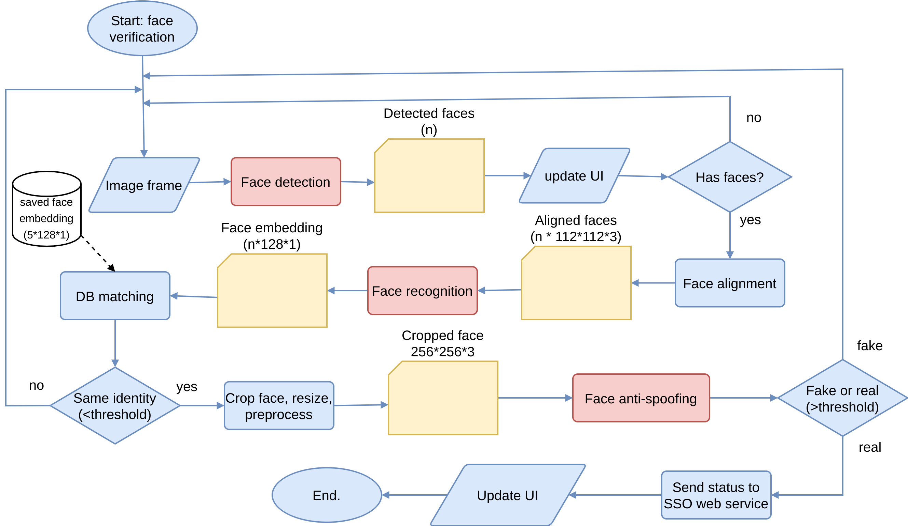

# DOneLogin Android: Facial verification for Two-Factors Authentication (2FA) on Android platform  

[oidc_provider_with_facial_mfa]: https://github.com/dangnh0611/oidc_provider_with_facial_mfa
[facial_verification_android]: https://github.com/dangnh0611/facial_verification_android
[MobileFaceNet_TF]: https://github.com/dangnh0611/MobileFaceNet_TF

## Table of contents
  - [About the project](#about-the-project)
  - [About this repository](#about-this-repository)
    - [Technologies](#technologies)
    - [Features](#features)
  - [Future works](#future-works)
  - [Inspirations](#inspirations)

## About the project
This repository is a part of the project: **DOneLogin: Single Sign On (SSO) Provider combined with Facial Two-Factors Authentication (2FA)**.

It contains 3 repositories:
- [oidc_provider_with_facial_mfa][oidc_provider_with_facial_mfa]: SSO Provider Web service
- [facial_verification_android][facial_verification_android]: An Android application to support 2FA with facial verification feature.  
- [MobileFaceNet_TF][MobileFaceNet_TF]: MobileFaceNet deep face recognition model

**For more detail about this project, visit this [project description](https://github.com/dangnh0611/oidc_provider_with_facial_mfa#about-the-project).**

---

## About this repository
This repository is the implementation of Android application which support facial 2FA.  
It applies deep learning techniques for face detection/recognition/anti-spoofing on frames captured from smart phone's frontal camera.

- **Face detection**: Face detector of [Google's MLKit](https://developers.google.com/ml-kit) on Android.
- **Face recognition**: MobileFaceNet ([source code][MobileFaceNet_TF] | [paper](https://arxiv.org/abs/1804.07573))
- **Face anti-spoofing**: Deep Tree Learning for Zero-shot Face Anti-Spoofing ([pre-train](https://github.com/syaringan357/Android-MobileFaceNet-MTCNN-FaceAntiSpoofing/blob/master/app/src/main/assets/FaceAntiSpoofing.tflite) | [source code](https://github.com/yaojieliu/CVPR2019-DeepTreeLearningForZeroShotFaceAntispoofing) | [paper](https://arxiv.org/abs/1904.02860))
> The pre-train of face anti-spoofing model has many problems, but it works in many cases. I'll find another model/method later.

---

### Technologies
- [CameraX](https://developer.android.com/training/camerax)
- [Tensorflow Lite](https://www.tensorflow.org/lite)
- [MLKit](https://developers.google.com/ml-kit)
- [Firebase Cloud Messaging](https://firebase.google.com/docs/cloud-messaging)
- [OpenCV Java](https://opencv-java-tutorials.readthedocs.io/en/latest/)
- [Zxing](https://github.com/zxing/zxing)
- [Android Keystore](https://developer.android.com/training/articles/keystore)
### Features
- [x] Linking to accounts on SSO web service
- [x] Face detection
- [x] Face recognition
- [x] Face anti-spoofing
- [x] Notifications powered by FCM
- [x] View/Accept/Reject face authentication request
- [x] Remove accounts
- [x] Sync authentication requests with SSO web service
- [ ] Sync account removal with SSO web service

---

## Future works
- [ ] Improve MobileFaceNet with new SOTA model
- [ ] Improve face anti-spoofing model with CDCD ([source code](https://github.com/ZitongYu/CDCN) | [paper](https://arxiv.org/abs/2003.04092))

---

## Inspirations
This project is inspired by the following repositories:
- [syaringan357/Android-MobileFaceNet-MTCNN-FaceAntiSpoofing](https://github.com/syaringan357/Android-MobileFaceNet-MTCNN-FaceAntiSpoofing)
- [google/mediapipe](https://github.com/google/mediapipe)
